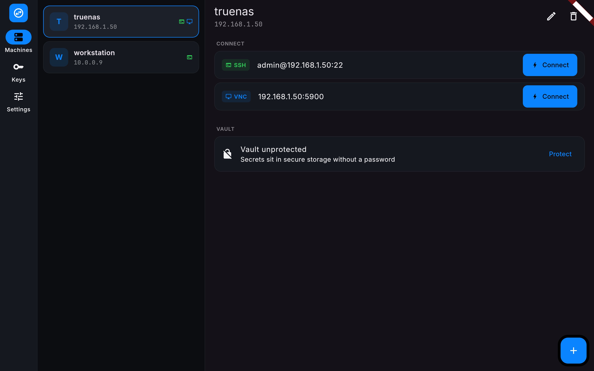
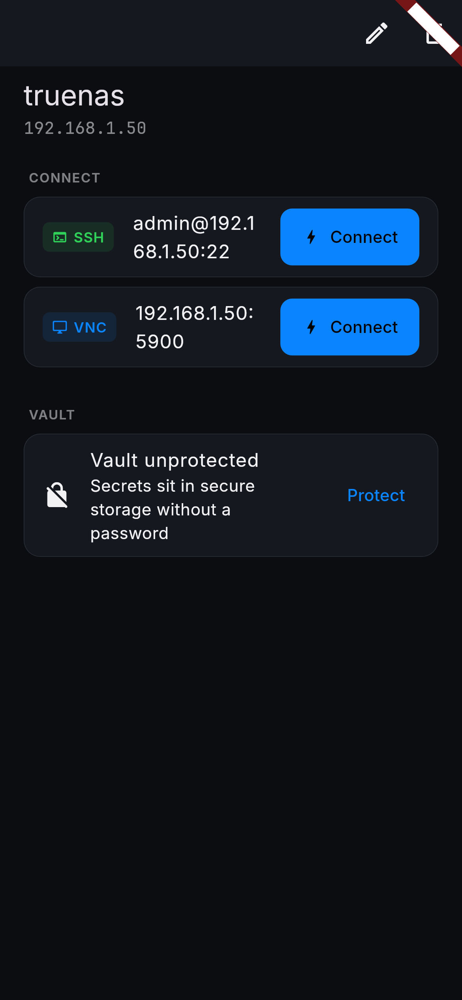
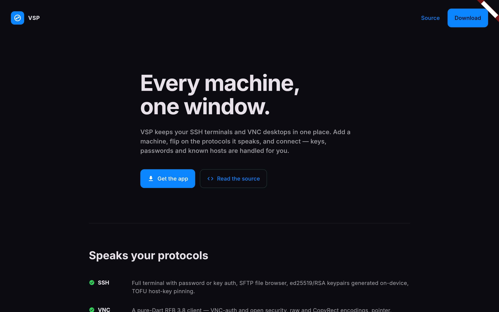
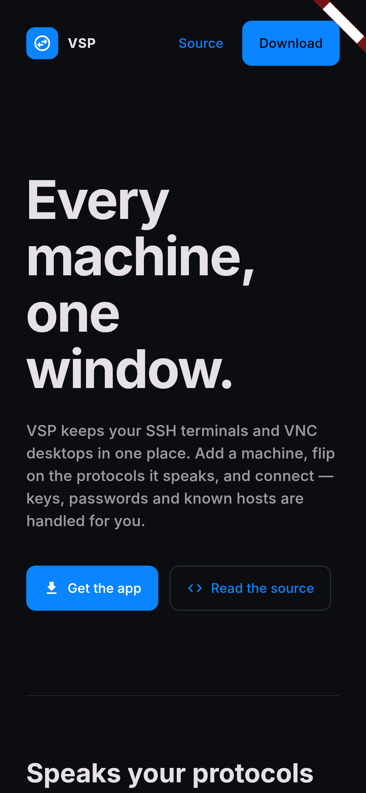

# VSP

One window into every machine. VSP is a remote-access client that keeps
your machines, their protocols, your keys, and your host fingerprints in
one place — SSH and VNC today, RDP and Moonlight behind the same driver
interface.

The web build is a landing page, not a remote client: remotes run on
Android, iOS, macOS, Windows, and Linux.

## Screenshots

| Machines (wide) | Machine detail (compact) |
| --- | --- |
|  |  |

| Landing (wide) | Landing (compact) |
| --- | --- |
|  |  |

## Features

- **Machine registry.** Name, host, groups, notes, and per-protocol
  capability toggles with ports and options.
- **SSH.** Full terminal (xterm), password or key auth, SFTP file
  browser, TOFU host-key pinning, on-device ed25519/RSA keypair
  generation, one-tap public-key deployment to `authorized_keys`.
- **VNC.** Pure-Dart RFB 3.8 client with VNC-auth and open security,
  raw/CopyRect encodings, pointer and keyboard input.
- **Vault.** Lock any machine's secrets behind a password — Argon2id
  key derivation, AES-256-GCM. Unlocked secrets sit in the platform
  keychain; locked ones are ciphertext until you type the password.
- **Extensible.** `ProtocolDriver`/`RemoteSession` interfaces with RDP
  and Moonlight stubbed as planned capabilities.
- **Adaptive UI.** Master-detail on wide windows, stacked on compact;
  state survives resizes.

## Build

```bash
flutter pub get
flutter run                 # desktop or mobile
flutter build web --release # landing page
```

## Test

```bash
flutter analyze
flutter test --coverage
VSP_SSH_TEST=1 flutter test # + real sshd integration tests
flutter test --update-goldens test/goldens_test.dart
```

CI runs the suite (including a fixture `sshd` for real SSH, SFTP, and
terminal coverage) and gates coverage at 80%.

## Architecture

```
lib/
  models/       machine, capability, protocol, key types
  security/     secret store abstraction + AES-GCM vault
  protocols/
    protocol_driver.dart   the extension point
    protocol_registry.dart kind -> driver
    ssh/                   dartssh2 wrapper, OpenSSH key codec, keygen
    vnc/                   RFB client, DES auth, keysym map, session
  ui/           adaptive shell, editor, detail, sessions, landing
```

## Release pipeline

GitLab main -> syncs to GitHub -> Actions verifies and builds every
platform -> release assets (apk, aab, deb, rpm, AppImage, zip, dmg,
unsigned iOS ipa, web tarball) -> synced back to the GitLab release and
Pages (landing page + AltStore source). Versions come from cocogitto
conventional commits; the tag pipeline ships the release.

## License

AGPL-3.0 — see LICENSE.
